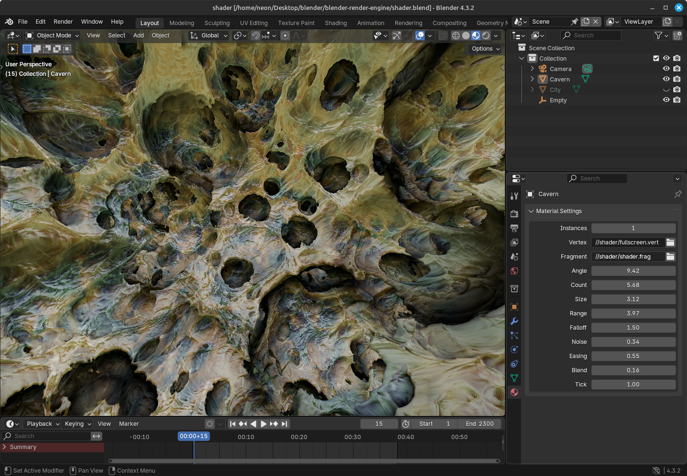
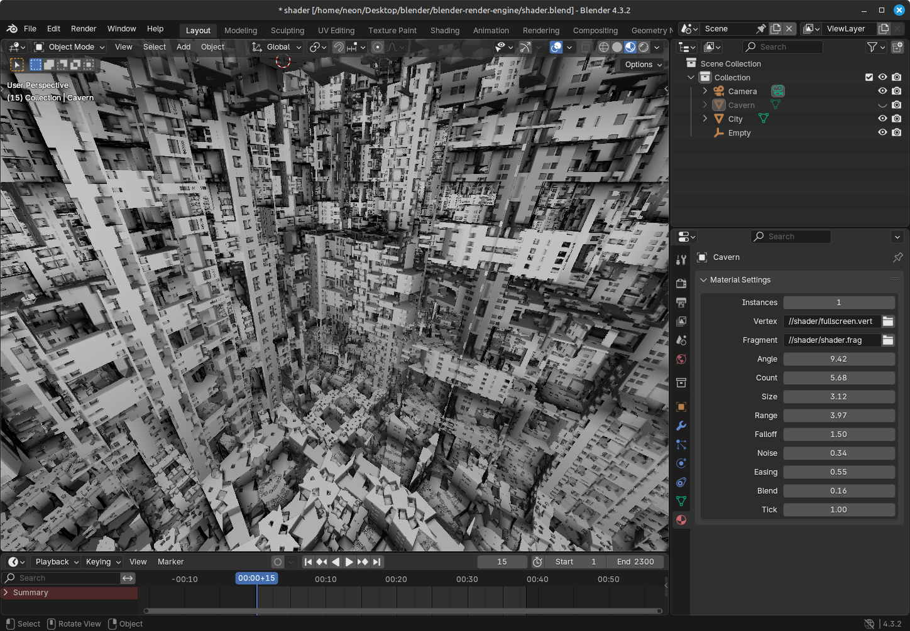

 # Blender GLSL Render Engine

This is a Blender add-on that adds a custom render engine. It is at the moment very basic but it can already display GLSL shaders like raymarching signed distance field fractals as seen in [ShaderToy](https://www.shadertoy.com/ "ShaderToy").  

## Basic usage

At the moment, you can explore the examples and play with parameters. Download the repository, install the add-on archive from file in Blender and open the `shader.blend` to have a scene ready.

## Write your own shader

To write your own shaders, you probably want to use [Visual Studio Code](https://code.visualstudio.com/download) and the packages [Blender Development](https://github.com/JacquesLucke/blender_vscode) and [GLSL Lint](https://github.com/hsimpson/vscode-glsllint) with [GLSLang validator](https://github.com/KhronosGroup/glslang) so you can hot reload the add-on while coding and have the details of shader compilation errors.  

The add-on is using Blender [GPU module](https://docs.blender.org/api/current/gpu.html), which does some shader file modification for the attributes, uniforms, varyings and fragment output. Thus there is small workaround in shader file to be compatible with both the GPU module and the GLSL Lint validator.

## About

It is using [Shiba](https://github.com/KoltesDigital/shiba "Shiba") as a main reference and inspiration. It was the tool we used with Jonathan Giroux aka [Koltes](https://github.com/KoltesDigital/) to make productions in demoscene. This add-on is kind of the spiritual successor of Shiba.  

Making another rendering engine being a silly idea, the purpose is to learn basic and advanced graphic programming concepts and to play with pixels. Integration with Blender is great because it is an excellent tool to view, edit, animate and render.  

The project will evolve as a research project, experimentation tool and playground interface for exploring visual excentricities. Below is a list of things done and what would be nice to have:

 - [x] Learn Blender API to add UI panels and store data
 - [x] Set up basic OpenGL to draw a triangle
 - [x] Connect camera matrix to a raymaching shader
 - [x] Parse uniforms and integrate them in material panel
 - [x] Make vertex buffer from mesh
 - [ ] Parsing varying and attribute
 - [ ] Hot reload of shader files
 - [ ] UI hint of float default, min and max
 - [ ] Transform matrix slot in panel
 - [ ] Depth writing to mix SDF and meshes
 - [ ] Proper cache, reload and recycle system
 - [ ] Stereographic projection
 - [ ] Frame buffer feedback effect
 - [ ] Deferred shading
 - [ ] Integration of VSE scene clip
 - [ ] Export video
 - [ ] Export as an executable  

## Alternatives

This add-on is not a SDF editor with stack of primitives and layers of boolean operations. If you are looking for that, you can check out:
- [MagicaCSG](https://ephtracy.github.io/index.html?page=magicacsg) by ephtracy
- [Neo](https://projectneo.adobe.com/) by Inigo Quilez and Adobe
- [Womp](https://womp.com/index) by Womp 3D
- [Clayxels](https://www.clayxels.com/) by Andrea Interguglielmi
- [Unbound](https://www.unbound.io/) by Florian Hoenig & Andrea Interguglielmi
- [Clavicula](https://clavicula.link/) by hypnotau
- [SculptGL](https://stephaneginier.com/archive/editSDF/) by Stéphane Ginier
- [SDF Editor](https://joetech.itch.io/sdf-editor) by Joe Tech

While the list above enumarates standalone softwares, there is [Ernst Renderer](https://github.com/iY0Yi/ErnstRenderer/) by iY0Yi that is a SDF editor Blender add-on.